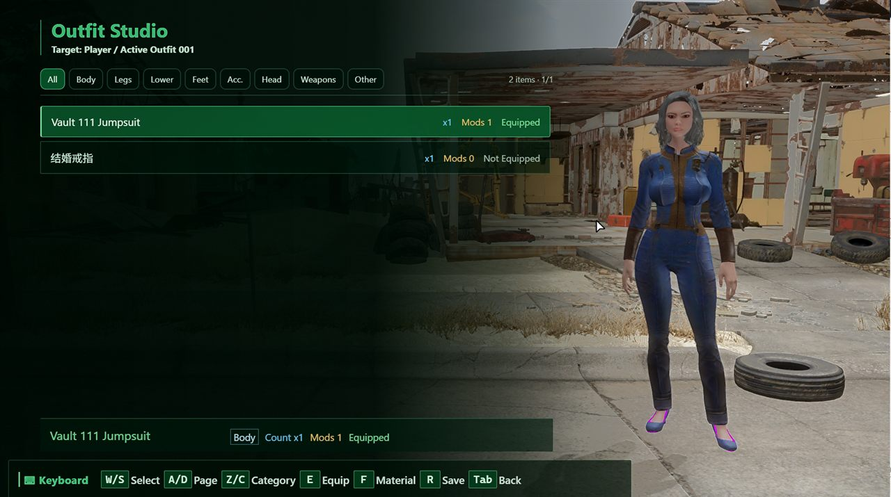
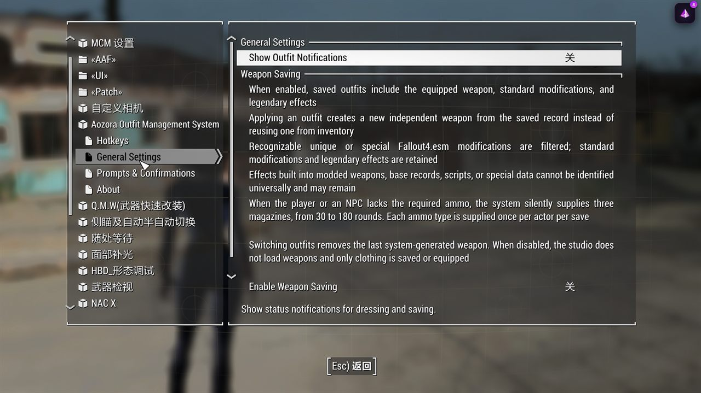

# Fallout 4 Aozora Outfit System

[](https://github.com/CythiaSu/Fallout4-AozoraOutfitSystem)
[](https://github.com/CythiaSu/Fallout4-AozoraOutfitSystem/tree/main/CHS)
[](https://github.com/CythiaSu/Fallout4-AozoraOutfitSystem#ui-and-input--ui)

**Aozora Outfit Management System 2.0.3** is a keyboard and gamepad-driven outfit management system for Fallout 4.

**青空的服装管理系统 2.0.3** 是一个面向 Fallout 4 的键盘与手柄操作服装管理系统。

This project is a full upgrade of Fallout4 Outfit Manager, with a redesigned Prisma UI workflow and a stable CHS/EN source split.

本项目由 Fallout4 Outfit Manager 全面升级而来，重新设计了 Prisma UI 工作流程，并提供稳定的中英文源码分支。

## 🎯 Main Features / 主要功能

### 🧩 Outfit Slots / 套装槽位

Save, rename, clear, restore, and cycle through up to 500 outfit slots.

支持最多 500 个套装槽位，可保存、命名、清空、还原并切换上一套或下一套套装。

The active outfit is shared by the UI and hotkey workflows, so later outfit actions continue from the last successfully equipped set.

UI 确认穿戴或热键成功装备后，会将该套装设为活跃套装，后续功能从当前活跃套装继续执行。

### 🪞 Preview and Outfit Studio / 预览与服装工作台

Preview saved outfits on the player or an eligible NPC before confirming the change.

可以在玩家或符合条件的 NPC 身上预览已保存套装，确认后才会正式换装。

The Outfit Studio starts from the character's actual outfit and supports browsing, equipping, unequipping, saving, and material preview workflows.

服装工作台从角色当前真实穿着开始，支持浏览、穿戴、脱下、保存和材质预览流程。

Material Swap generation is primarily designed for mod clothing that uses MSWP records.

材质交换生成主要面向使用 MSWP 记录的 MOD 服装。

Workbench or third-party modifications can be restored when their final state is represented by a base item plus OMOD data; script-driven or custom runtime data cannot be guaranteed.

只要工作台或第三方改装最终表现为基础物品加 OMOD 数据，系统就可以尝试保存和还原；脚本驱动或其他自定义运行时数据无法保证兼容。

### 👥 Player and NPC Management / 玩家与 NPC 管理

Manage the player and eligible humanoid NPCs while respecting combat, target, and workbench restrictions.

支持管理玩家和符合条件的人形 NPC，并遵守战斗状态、目标状态和工作台使用限制。

NPC preview handling includes camera positioning and movement control so outfit changes can be inspected more reliably.

NPC 预览流程包含镜头定位和移动控制，让换装检查更加稳定。

### 🔧 Weapon Preservation / 武器保存

Weapon saving can be enabled separately in MCM and records standard weapon modifications when a set is saved.

武器保存可以在 MCM 中单独开启，保存套装时会记录武器的普通改装。

Legendary effects are retained, while recognizable unique or special Fallout4.esm effects are filtered according to the release rules.

传奇效果会保留，可识别的 Fallout4.esm 独特或特殊效果会按照发布规则过滤。

### 🎮 UI and Input / UI 与操作

The stable release supports keyboard and gamepad navigation, with mouse input intentionally disabled because of the Prisma UI 2.x focus regression.

稳定版支持键盘与手柄操作，鼠标功能暂时关闭，因为 Prisma UI 2.x 存在焦点回归问题。

The UI has dedicated 16:9 and 16:10 layout baselines, while 21:9 displays reuse the 16:9 height scaling.

UI 提供独立的 16:9 与 16:10 基准布局，21:9 屏幕沿用 16:9 的高度缩放逻辑。

## 🖼️ Screenshots / 界面预览

### Main Page / 主页面

The main page provides quick access to outfit confirmation, random preview, outfit management, target selection, the Outfit Studio, and default outfit restoration.

主页面提供确认穿戴、随机试穿、套装管理、选择目标、服装工作台和恢复默认服装等入口。


### Outfit Management / 套装管理

The outfit management page shows saved slots, names, genders, item counts, and the active outfit state.

套装管理页面显示已保存槽位、套装名称、性别、物品数量和当前活跃套装状态。


### Outfit Studio / 服装工作台

The Outfit Studio lets you inspect the character's current clothing, browse categories, preview items, and open material workflows.

服装工作台可以查看角色当前服装、浏览分类、预览单件物品并进入材质交换流程。



### MCM General Settings / MCM 通用设置

MCM provides the global hotkeys, weapon-saving switch, confirmation settings, and other behavior controls.

MCM 提供全局热键、武器保存开关、确认提示设置和其他行为控制。



## 📁 Source Layout / 源码结构

```text
CHS/2.0.3/      Chinese source and UI configuration
EN/2.0.3/       English source and UI configuration
tools/           Asset and UI validation utilities
docs/            Build and release notes
```

The native logic is kept aligned between CHS and EN, with localized messages in each language branch.

CHS 与 EN 两套原生逻辑保持一致，仅分别保留对应语言的提示文本和槽位名称注释。

Papyrus and UI files are separated by language so either release can be packaged without mixing files.

Papyrus 与 UI 文件按语言分开，便于分别构建中文或英文版本，避免文件混用。

## 🧱 Requirements / 必需前置

- Fallout 4 Script Extender (F4SE)
- 辐射 4 脚本扩展器（F4SE）
- Address Library for F4SE Plugins
- F4SE 插件地址库
- Mod Configuration Menu (MCM)
- Mod Configuration Menu（MCM）
- Prisma UI Framework 2.0.3 or a compatible later 2.x version
- Prisma UI Framework 2.0.3 或兼容的后续 2.x 版本
- Garden of Eden Papyrus Script Extender (GOE)
- Garden of Eden Papyrus Script Extender（GOE）
- Visual Studio 2022 x64 toolchain for the native plugin
- 用于编译原生插件的 Visual Studio 2022 x64 工具链
- CommonLibF4 and spdlog build dependencies
- CommonLibF4 与 spdlog 构建依赖
- Caprica or an equivalent Fallout 4 Papyrus compiler
- Caprica 或其他兼容的 Fallout 4 Papyrus 编译器

## 🛠️ Build Notes / 构建说明

The native project uses `xmake.lua` and CommonLibF4; build each language variant from its own `Native` directory.

原生项目使用 `xmake.lua` 和 CommonLibF4；请从对应语言的 `Native` 目录分别构建。

Papyrus sources are under each language's `Papyrus/Source/User` directory and must be compiled separately.

Papyrus 源码位于各语言的 `Papyrus/Source/User` 目录，需要单独编译。

Generated DLL, PEX, ESP, object, library, build-cache files, and release-only mascot images are intentionally excluded.

仓库不会上传生成的 DLL、PEX、ESP、OBJ、LIB、编译缓存和仅用于发布包的辐射娘图片素材。

The release package is assembled from the selected language source, UI/MCM files, compiled Papyrus output, and the stable release assets.

发布包由对应语言源码、UI/MCM 文件、编译后的 Papyrus 文件和稳定版素材组装而成。

The stable release is keyboard/gamepad driven; mouse input remains disabled because of the Prisma UI 2.x focus regression.

稳定版使用键盘和手柄操作；鼠标功能暂时关闭，因为 Prisma UI 2.x 存在焦点回归问题。

## 🧪 Compatibility Scope / 兼容范围

Material Swap support primarily targets mod clothing that exposes material variants through MSWP records.

材质交换功能主要面向通过 MSWP 记录提供材质变体的 MOD 服装。

Workbench or third-party modifications can be restored when the final item is represented by a base item plus OMOD data.

只要工作台或第三方改装最终表现为基础物品加 OMOD 数据，系统就可以尝试保存和还原。

Script-driven changes and other custom runtime data cannot be guaranteed to restore correctly.

脚本驱动的改装和其他自定义运行时数据无法保证正确还原。

The system supports 500 outfit slots and preserves the existing OutfitManager plugin and data identifiers.

系统支持 500 个套装槽位，并保留原有 OutfitManager 插件与数据标识，以兼容已有全局套装数据。
